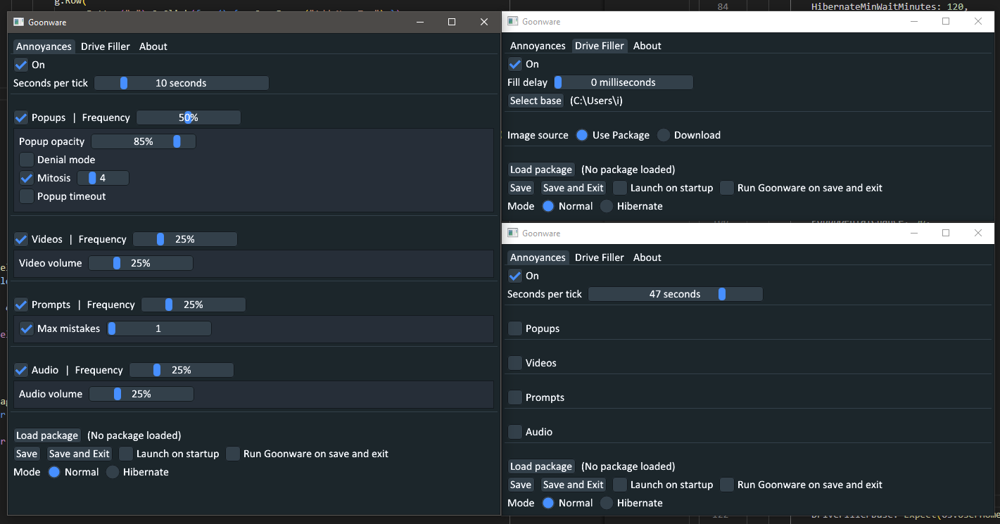

# goonware

Edgeware but in Go for cumming performance™™™™

# Build Instructions

just `go build`; on Linux you might need to install `libx11`, and on Windows you need GCC -- the it just werksTM solution is https://jmeubank.github.io/tdm-gcc/.

# Notes

- edgeware_package.go in particular is very crashy (i.e. a lot of if err != nil { panic(err) }) atm
- prompt text input must match exactly, the option to allow mistakes is ignored til i check how edgeware does it
- configurator/general.go::general() in particular really needs the DRY treatement

Perhaps surprisingly, zip isn't exactly a great package format because
it depends on random access to read, ergo it can't be decompressed in
a stream (unlike, for example, gzip), which means decompressing a zip
means loading the entire zip into memory. Or, maybe it is streamable?

Nobody really knows.

Nobody really likes zip.

# License

See LICENSE